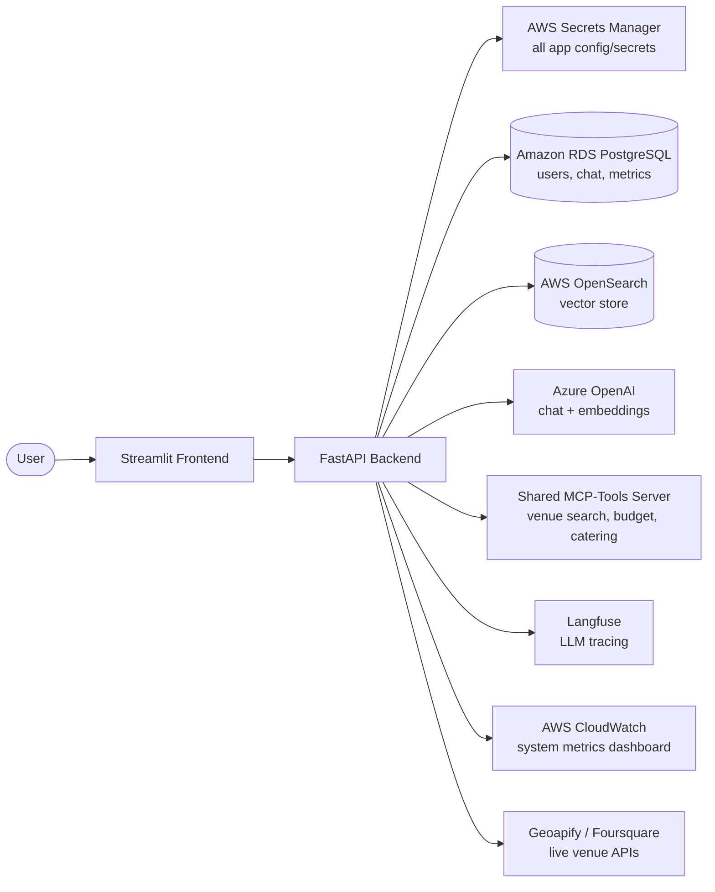

# AI Event Management Platform

An event-planning assistant that combines a multi-agent AI system with RAG over your own event documents and live venue/catering data. Ask it to find a venue for 250 people under budget in a specific area, plan catering around dietary requirements, or estimate a budget split — it delegates across specialist agents, retrieves grounded context, and cites its sources.

## Business problem

Planning an event — a corporate conference, a wedding, a product launch — means manually cross-referencing several disconnected sources: venue listing sites, catering directories, budget rules of thumb, and whatever brief or requirements document the client already sent over. A single "find me a venue" question routinely means checking capacity against a guest count, cross-referencing hire price against a budget, confirming the venue is actually in the right neighbourhood, and then repeating a similar search for catering — each step a separate manual lookup.

**Who has this problem:** event planners and anyone organizing a one-off event (a startup planning an offsite, an assistant booking a company party) without a dedicated venue-sourcing agency.

**Why it matters:** venue and catering research for a single mid-sized event commonly takes several hours spread across multiple sites and phone calls, and it's repeated from scratch for every event because requirements (guest count, budget, dietary mix, location) change each time.

**What this platform does about it:** a multi-agent AI system takes one natural-language brief and does the cross-referencing automatically — a Venue Agent filters indexed and live venue data by capacity/budget/area, a Catering Agent checks in-house vs external options against dietary requirements and estimates a category-level budget split, and a Lead Orchestrator combines both into one grounded, sourced answer. RAG over the user's own uploaded event brief means the answer also respects constraints that only exist in that specific document (e.g. "must be wheelchair accessible", "client wants a riverside view"), not just generic venue-directory data.

## Architecture

- **Backend**: FastAPI (`backend/`)
- **Frontend**: Streamlit (`frontend/`)
- **Database**: Amazon RDS for PostgreSQL (users, events, chat history, indexed sources, query metrics) — see `infra/rds-postgres-db.yml`
- **Vector store**: AWS OpenSearch (cloud-hosted RAG backend — see `infra/opensearch-vector-db.yml`)
- **Secrets**: AWS Secrets Manager holds every application secret (DB URL, JWT key, Azure OpenAI, OpenSearch creds, venue API keys, MCP caller ID, Langfuse keys) as one consolidated secret, fetched at backend startup — see `infra/secrets-manager.yml` and [Configuration](#configuration) below
- **LLM**: Azure OpenAI (chat + embeddings)
- **Multi-agent system**: a Lead Orchestrator delegating to a Venue Specialist and a Catering Specialist agent (`backend/app/services/agents/`)
- **Shared MCP server**: tool calls to the team's shared MCP-Tools server (venue search, budget planning, catering guides) — see the sibling `MCP-Tools` repo
- **LLM tracing**: Langfuse (every LLM call across the app)
- **System observability**: AWS CloudWatch dashboard (request volume, latency, error rate, token usage, estimated cost) — see `infra/observability-dashboard.yml`
- **RAG evaluation**: RAGAS scores computed two ways — reference-free (faithfulness, answer relevancy, context precision) live per query, viewable in-app on the Query Insights page; and all 4 classic metrics (adding context recall) run offline against a 22-example golden dataset (`backend/eval/`) — see [Evaluation](#evaluation) below

### High-level architecture



### Low-level architecture

```mermaid
flowchart TD
    subgraph API["backend/app/api/ai.py"]
        EP_chat["/ai/chat"]
        EP_rag["/ai/rag"]
        EP_agent["/ai/agent"]
    end

    EP_agent --> ORCH["Orchestrator Agent<br/>consult_venue_agent, consult_catering_agent"]

    ORCH --> VA["Venue Agent"]
    ORCH --> CA["Catering Agent"]

    VA --> T1["rag_search<br/>vector_store.query()"]
    VA --> T2["filter_by_capacity<br/>vector_store.get_by_filter()"]
    VA --> T3["search_venues_live<br/>venue_service + MCP em_search_venues, merged"]

    CA --> T4["find_catering_options<br/>venue_service.get_catering_profile<br/>+ MCP em_catering_guide, overlaid"]
    CA --> T5["get_catering_budget_estimate<br/>MCP em_budget_planner"]

    EP_rag --> RAGS["rag_service<br/>query_with_smart_filters,<br/>generate_rag_response_json"]
    RAGS --> VS["vector_store<br/>OpenSearch, shared index,<br/>collection_name filter"]

    T1 --> VS
    T2 --> VS

    EP_chat --> LLM["_openai_client&#40;&#41;<br/>rag_service.py"]
    RAGS --> LLM
    VA --> LLM
    CA --> LLM
    ORCH --> LLM

    LLM -->|wrapped| LANGFUSE["Langfuse tracing"]
    LLM -->|wrapped| TOKENMETRICS["metrics_service<br/>CloudWatch token/cost"]

    EP_chat --> QM["query_metrics_service<br/>latency, tokens, cost"]
    EP_rag --> QM
    EP_agent --> QM
    QM --> RAGASBG["ragas_service<br/>background thread:<br/>faithfulness, answer relevancy,<br/>context precision"]

    EP_chat --> AICHAT["ai_chat_service<br/>persisted chat history"]
    EP_rag --> AICHAT
    EP_agent --> AICHAT
```



## Repository structure

```
backend/
  app/
    api/         FastAPI routers (auth, events, chat, venues, ai, indexing, health, mcp)
    core/        settings, database engine/session
    models/      SQLAlchemy models
    schemas/     Pydantic request/response schemas
    services/    business logic (agents, RAG, MCP client, metrics, RAGAS, etc.)
    prompts/     versioned LLM prompt catalogue (one file per prompt)
  eval/
    fixtures/venues.json     13 synthetic venues (3 cities) — the golden dataset's fixed "world"
    golden_dataset.json      22 hand-curated input/expected-output examples
    index_fixture.py         indexes the fixture into per-city OpenSearch collections
    run_ragas_eval.py        runs the dataset through the real pipeline, scores with RAGAS
    results/                 JSON reports land here (gitignored, regenerated each run)
  Dockerfile
  requirements.txt

frontend/
  pages/         one Streamlit page per feature (Events, Chat, AI Assistant, Data Indexing,
                 Profile, System Health, Smart Planner, Query Insights)
  client/        HTTP client wrapping the backend API
  utils/         auth/session helpers shared across pages
  Dockerfile
  requirements.txt

infra/           CloudFormation templates for AWS resources (OpenSearch domain, CloudWatch dashboard)
docker-compose.yml
```

## Setup

1. Copy `.env.example` to `.env` and fill in:
   - `BACKEND_URL` for the frontend (defaults are fine for local Docker use)
   - AWS credentials + region — the only secrets that live outside Secrets Manager, since they're what the app uses to reach it in the first place

2. Provision the AWS Secrets Manager secret (one-time):
   ```
   aws cloudformation deploy --template-file infra/secrets-manager.yml --stack-name dstrmaysam-evmgmt-secrets --region eu-west-2
   ```
   then populate it with real values in the JSON shape documented in `.env.example`:
   ```
   aws secretsmanager put-secret-value --secret-id dstrmaysam-evmgmt-secrets --secret-string file://secrets.json --region eu-west-2
   ```
   This holds the DB URL, JWT key, Azure OpenAI keys, OpenSearch domain endpoint + credentials (see `infra/opensearch-vector-db.yml` to provision the domain itself), Geoapify/Foursquare API keys, MCP-Tools server URL + caller ID, and Langfuse keys — the backend fetches all of it at startup and fails to start if it can't reach Secrets Manager (no local fallback).

3. Dependencies are pinned in `backend/requirements.txt` and `frontend/requirements.txt` for reproducible installs.

4. Activate the pre-push test hook (one-time per clone):
   ```
   git config core.hooksPath .githooks
   ```
   This runs the backend unit test suite (`backend/tests/`) before every `git push`, using the already-built `event-management-backend` Docker image with the current source mounted in — no rebuild or real DB/AWS credentials required. A failing test blocks the push.

## Run

**With Docker:**
```
docker-compose up --build
```
- Backend: http://localhost:8080 (docs at `/docs`)
- Frontend: http://localhost:8501

**Without Docker** (two terminals):
```
cd backend && pip install -r requirements.txt && uvicorn app.main:app --reload
cd frontend && pip install -r requirements.txt && streamlit run app.py
```

Database tables are created automatically on backend startup (`init_db()` — no migration step needed).

## Observability

- **LLM traces** (every prompt/completion, tokens, latency, cost per call): Langfuse dashboard at the URL configured in `LANGFUSE_BASE_URL`.
- **System metrics** (request volume, latency p50/p95, error rate, token usage, estimated cost): CloudWatch dashboard `dstrmaysam-evmgmt-observability` (deploy via `infra/observability-dashboard.yml`).
- **Per-query cost/latency/RAGAS scores**: in-app "Query Insights" page (`frontend/pages/8_Query_Insights.py`).

## Evaluation

**Golden dataset**: `backend/eval/golden_dataset.json` — 22 hand-curated examples covering capacity search, budget search, area search, catering questions, multi-agent (venue+catering) requests, edge cases (impossible capacity/budget, a city not in the data at all), and multi-turn follow-ups that exercise pronoun/reference resolution. Ground truth is checkable against a small fixed fixture of 13 synthetic venues (`backend/eval/fixtures/venues.json`) indexed into dedicated per-city OpenSearch collections — not live venue APIs, which are non-deterministic over time and would make "golden" ground truth meaningless.

**Run it:**
```
cd backend && python -m eval.run_ragas_eval
```
Flags: `--no-reindex` (skip re-indexing the fixture), `--cleanup` (delete the eval collections afterward), `--limit N`, `--only <id>`, `--output <path>`.

Because every example has a ground-truth `reference` answer, this offline run computes all 4 classic RAGAS metrics (unlike the live per-query scoring, which only computes the 3 reference-free ones). Latest real run, 22/22 examples scored successfully:

| Metric | Mean |
|---|---|
| Faithfulness | 0.876 |
| Answer Relevancy | 0.754 |
| Context Precision | 0.402 |
| Context Recall | 0.909 |

**Reading context_precision's low score honestly**: this isn't a scoring bug — inspecting the retrieved context directly showed the correct venue consistently ranked first, but each query still pulls in every other venue in that city (a small fixture means every venue fits within the retrieval limit) *plus* a duplicate raw-JSON chunk per venue that exists for exact-lookup use cases, not semantic relevance. That's a lot of low-relevance noise around one correct answer, which is exactly what a precision metric is supposed to penalize. It's a genuine, actionable finding about retrieval noise, not an artifact of the eval setup.

## Limitations & drawbacks

Being honest about where this system falls short:

- **No automated tests or CI/CD yet.** There is no pre-push hook, no unit test suite, and no build pipeline. Every verification so far has been manual (real HTTP calls against a running server). This is the single biggest gap for anyone extending this codebase with confidence.
- **RAGAS context recall is not computed live.** Only reference-free metrics run per live query (faithfulness, answer relevancy, context precision) because a real user query has no ground-truth answer to check against. Full 4-metric coverage (including context recall) only exists in the offline golden-dataset run (`backend/eval/run_ragas_eval.py`), not the live Query Insights dashboard.
- **Context precision on the golden dataset is currently weak (mean 0.402).** Retrieval returns every venue in the relevant city rather than a tightly filtered top-k, plus a duplicate raw-JSON chunk per venue — real signal-to-noise dilution in retrieval, not a display bug (see Evaluation section above).
- **Agent reasoning is capped.** The Orchestrator stops after `MAX_ITERATIONS = 6` (and each specialist agent after 3–5), falling back to a "reached maximum reasoning steps" answer. Genuinely complex, multi-part requests can get truncated rather than fully resolved.
- **Live venue search depends on third-party rate limits and coverage.** Geoapify, Foursquare, and OpenStreetMap results vary by city and can be sparse outside major metro areas; the merged MCP results help but don't eliminate this.
- **The shared OpenSearch index is filtered, not physically isolated.** All users' indexed data lives in one index with `collection_name` as a filter field (a deliberate choice to avoid shard exhaustion from creating one physical index per user/city/event). This is standard multi-tenant practice, but it means tenant isolation depends on every query correctly applying that filter, rather than the vector DB enforcing it structurally.
- **RAGAS scoring adds real ongoing cost that isn't reflected in the displayed cost metrics.** Every scored query triggers several additional judge-LLM calls purely for scoring, on top of the cost of generating the answer itself — but `ragas_service.py` uses its own separate `langchain_openai` client rather than the instrumented `rag_service._openai_client()`, so the Query Insights "Avg Cost/Query" figure only reflects answer-generation cost, not evaluation overhead.
- **CloudWatch metrics depend on credential freshness.** The AWS credentials used for both OpenSearch provisioning and CloudWatch metric pushes are currently temporary SSO session credentials in local development, not a long-lived IAM user — metric pushes silently stop (without breaking the app) if the session expires.

## Obstacles, challenges, and how we overcame them

Concrete problems hit during development of this specific system, not generic "prompt engineering was hard" statements:

**1. OpenSearch rejected the k-NN index mapping outright.**
The initial vector index used `engine: faiss` with `space_type: cosinesimil`, which is a real, silent-until-you-try-it incompatibility — OpenSearch's faiss engine only supports `l2`/`innerproduct`, not cosine similarity. We hit this as a hard `mapper_parsing_exception` the first time the index was created against the live domain. Fixed by switching the engine to `nmslib`, which supports `cosinesimil` natively — verified by re-running the same index-creation call against the real OpenSearch domain and confirming the mapping succeeded.

**2. Swapping a local implementation for the shared MCP server would have silently broken external catering search.**
Before wiring the Catering Agent to the team's shared MCP server, we found that the local `get_catering_profile()` function returns `geoapify_cats`/`osm_amenity` fields that drive the actual Geoapify category search — fields that MCP's `em_catering_guide` tool does not return (it only returns descriptive text: label/food style/notes). A naive full swap to MCP would have made every external catering search fall back to generic default categories for every event type. We caught this by reading both implementations side-by-side before wiring, and resolved it by merging: MCP supplies the descriptive text, the local profile keeps supplying the search-driving category fields. Verified live against the running MCP server with real event types.

**3. `ragas` 0.4.3 was broken out of the box due to an upstream packaging conflict.**
Installing the latest `ragas` failed with `ModuleNotFoundError: No module named 'langchain_community.chat_models.vertexai'`. Investigation showed `ragas` 0.4.3 hard-imports that module at load time, but it no longer exists in current `langchain-community` releases (moved out during LangChain's ecosystem cleanup) — while `ragas` 0.4.3 simultaneously depends on newer `langgraph`/`langchain-core` that are incompatible with the *older* `langchain-community` version that still has that module. The two constraints can't be satisfied together. Resolved by pinning the older, stable `ragas==0.2.15` with a matching `langchain-openai==0.2.14`, verified by installing in a clean isolated virtualenv (the shared global Python environment had leftover packages from unrelated work that masked the real conflict on the first few attempts) and running a real scoring call against Azure OpenAI to confirm it worked end-to-end.

**4. `.env` is never actually read inside the Docker containers.**
Settings are loaded via `pydantic-settings`' `env_file=".env"`, but the Docker build context for the backend is `./backend` only — the real `.env` file lives at the repo root and is never copied into the image. This means every setting the containerized app uses must be passed explicitly through `docker-compose.yml`'s `environment:` block, or it silently falls back to the code's default value. We hit this while adding Langfuse, AWS, and OpenSearch settings — each new credential had to be explicitly added to `docker-compose.yml`, not just `.env`, or the containerized backend would authenticate with nothing and fail silently rather than erroring clearly.

**5. A stale background server kept answering requests with old code during verification.**
While testing the observability dashboard, a previous test server (left running from an earlier verification pass) was still bound to the same port and serving traffic — meaning a batch of "successful" test requests had actually exercised old code with none of the new instrumentation. We caught this because the expected CloudWatch metrics didn't show up after the test, traced it to the stale process via `netstat`, and killed it directly by PID (the harness's own stop signal wasn't sufficient in this case). The fix going forward: always confirm the port is free before starting a fresh verification server, not just that a new process started successfully.

**6. RAGAS scores silently failed to save, permanently stuck at "pending", with zero errors logged.**
Live queries in production showed `ragas_status: "pending"` forever instead of transitioning to "scored". Root cause: RAGAS returns scores as `numpy.float64`, not a plain Python `float`. psycopg2 has no adapter for that type, so it serialized the value into the SQL statement as the literal text `np.float64(0.361...)` — Postgres then rejected it as an attempt to call a function in a nonexistent schema named `np`. That exception happened *after* the DB session was already open, inside a fire-and-forget `ThreadPoolExecutor.submit()` call whose returned `Future` nobody ever checked — a classic Python gotcha where an unhandled exception in a background thread vanishes completely silently unless something calls `.result()` or `.exception()` on it. We found it by directly reproducing the exact concurrency pattern (`ThreadPoolExecutor` → `asyncio.run()` → real Azure OpenAI + Postgres calls) inside the running container with logging turned all the way up, which surfaced the actual traceback the production logs never showed. Fixed by casting every RAGAS score to `float()` right at the source, plus adding proper exception logging around the database write so a future failure of this kind would actually appear in the logs instead of disappearing.

**7. A shared eval fixture collection let one city's venue contaminate another city's answer.**
The first version of the golden-dataset fixture indexed all 13 venues (3 cities) into one OpenSearch collection. `rag_service.query_with_smart_filters` filters by capacity and budget but has no city filter, so a "venue in Manchester" query with a large-enough capacity threshold could — and did — pull in Edinburgh's Grand Ballroom purely because it also satisfied the capacity filter, tanking `context_precision` for reasons that had nothing to do with actual answer quality. We caught this by inspecting the actual retrieved context strings for a low-scoring example and noticing a venue from the wrong city. Fixed by indexing one collection per city (mirroring how production actually scopes real data — per user/city/event, never one giant mixed bucket) and selecting the right collection(s) based on each golden example's city field.
